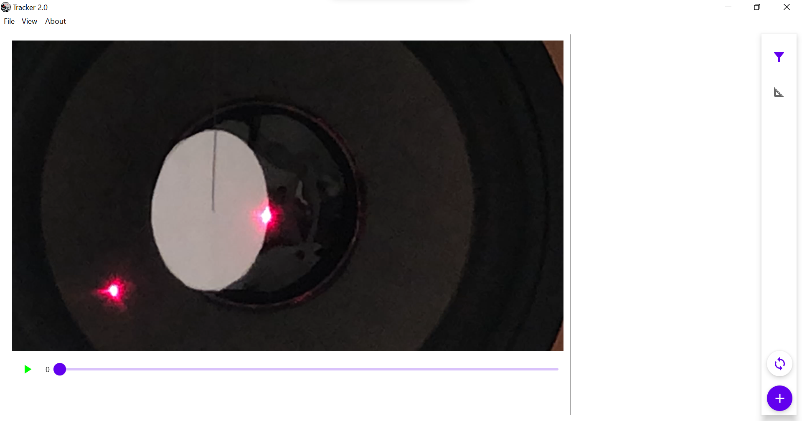
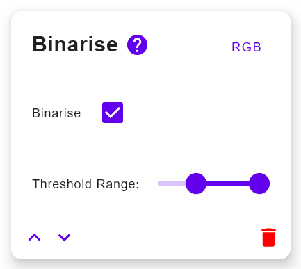
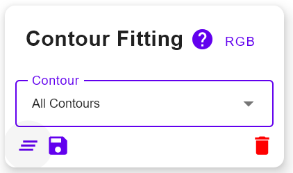

# TrackerV2

Literally just Tracker, but better.

To build the application, run
```
./gradlew build
```

To run the application, run
```
./gradlew run
```

To build the binaries, run
```
./gradlew createReleaseDistributable
```

## How to use?

TrackerV2 consists of 2 sections - the video player and the node editor.



The former on the left is where you can view the video and make adjustments to scaling (coming soon, i hope) and axes position.

The latter on the right is where you adjust the configuration of the tracking program to fit circles, filter colours, binarise, etc.

### Using the Video Player

It's a normal video player. Use it as you would a normal video player.

### Using the Node Editor

There are 2 sections here - preprocessing and postprocessing nodes. Preprocessing nodes refers to actions that are needed
to extract the object you want to track from the image like binarisation, blurring and edge detection. Postprocessing nodes
refer to directly collecting information about the object that you are trakcing.

Click on the '+' to add nodes. Based on which tab you are in, the nodes you can add will either be the preprocessing nodes
or the postprocessing nodes.

### Using Preprocessing Nodes



Press the ? for more information about how to use the node. The red bin button does what you think it does
(it deletes the node). The up and down arros shift the node up and down. The top right button that says RGB allows you
to change what colourspace the node operates in (RGB, HSV or grayscale).

### Using Postprocessing Nodes



The stack button at the bottom left clear the data that has been collected.
The save button can be used to save the data that has been collected.

## Saving Configurations

Click File -> Save / Open Configuration. Configurations include the pre and postprocessing nodes but not the videos or the data.
Also they are stored in *.trk2 files.

## Batching Configurations

It is also possible to use TrackerV2 to batch process a large number of videos. To do this, go to click Batch -> Batch Current Configuration.
With this, you will be able to select which files you want to use and the program will run on those files.